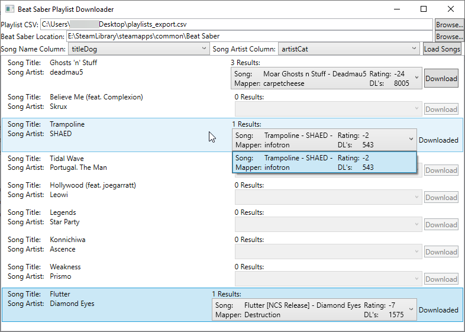

# Beat Saber Playlist Downloader

----
## What is this tool?
This tool allow takes a CSV consisting of at least a Song Title column, and a Song Artist Column, and searches beatsaver.com for it. If there's any matches, it allows you download it automatically to your Beat Saber installation.

See [this YouTube video](https://youtu.be/0YM0XURxMSU) for more info.

----
## Usage
0. Make sure it correctly detected your Beat Saber install. If it did not, browse to the folder that contains Beat Saber.exe
1. Obtain a CSV of your desired playlist. I'm a user of Google Play Music, so I used [this browser script](https://github.com/soulfx/gmusic-playlist.js/). 
2. Open the CSV in this program (BSPD).
3. Wait for it to search each song. It can only do one song per second due to rate limiting on [beatsaver.com](http://beatsaver.com).
4. If the song has results, drop them down and select the one you want.
5. Click download. The song will be automatically downloaded and extracted to the proper directory.
6. Start the game and play the darn song.

----
## There Will Be Bugs
But I encourage you to create an issue for them. I threw this together late one night, so there may be problems. A log file will be created in the same directory as the .exe. Please include this log file *and a brief description of what you were doing when the issue arose* so we can track it down. 

**Enjoy!**